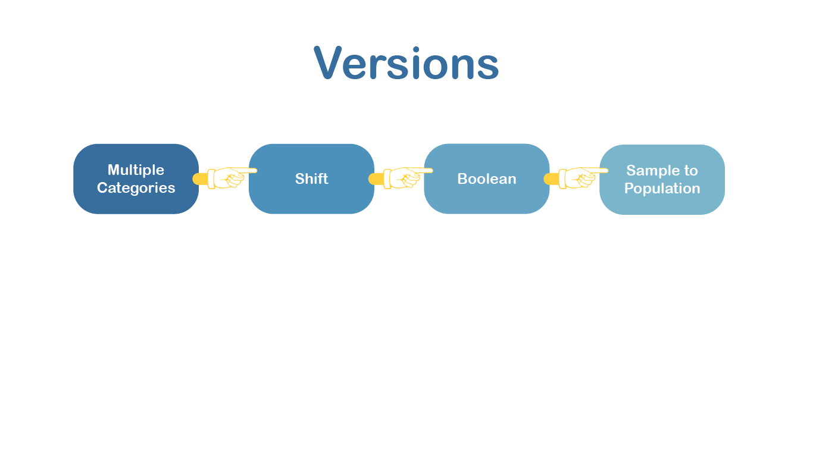
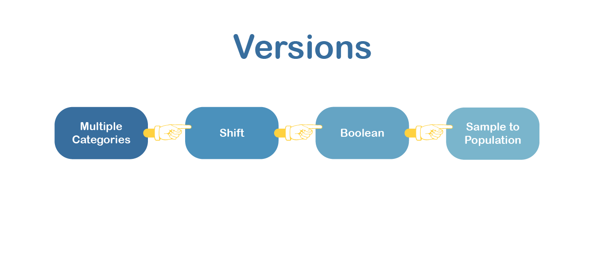
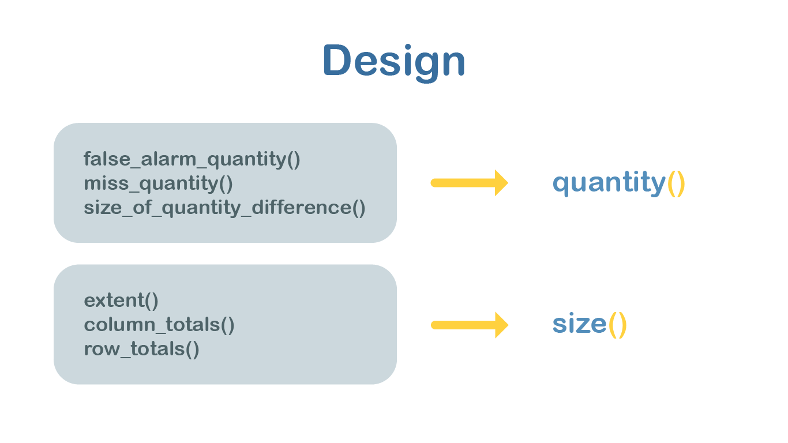

# Process

#### Input


<p align="center">
Raster Images from 1971 and 1985 


#### Library Imports


```python
import numpy as np
import pandas as pd
```

#### Contingency Matrix


```python
df = pd.read_csv('sample.csv', index_col= 0)
display(df)
```


|      | Built | Barren | Forest | Water | 
|--------|-------|--------|--------|-------| 
| Built  | 612   | 0      | 0      | 0     | 
| Barren | 168   | 561    | 0      | 0     | 
| Forest | 292   | 83     | 2197   | 0     | 
| Water  | 0     | 0      | 0      | 183   | 

#### Translating Logic


```python
# false alarm quantity
def false_alarm_quantity(data):
    false_alarm_quantity_np = np.zeros(shape = (1, len(data)))
    for i in range(0, len(data)):
        false_alarm_quantity_np[0,i] = np.max((0, (false_alarms(data)[0,i] - misses(data)[0,i])))
    return(false_alarm_quantity_np)
```


```python
# misss quantity
def miss_quantity(data):
    miss_quantity_np = np.zeros(shape = (1, len(data)))
    for i in range(0, len(data)):
        miss_quantity_np[0,i] = np.max((0, (misses(data)[0,i] - false_alarms(data)[0, i])))
    return(miss_quantity_np)
```


```python
# Quantity difference/disagreement for k (Dqk):
def size_of_quantity_difference(data):
    size_of_quantity_difference_np = abs(misses(data) - false_alarms(data))
    return(size_of_quantity_difference_np)
```


```python
# extent of contingency table (total pixel count)
def extent(data):
    return(np.sum(data))
```


```python
#find column sums
def column_totals(data):
    column_totals_np = np.zeros(shape=(1, len(data)))
    for i in range(0, len(data)):
        column_totals_np[0,i] = np.sum((data[:,i]))
    return(column_totals_np)
```


```python
# find row totals:
def row_totals(data):
    row_totals_np = np.zeros(shape=(1, len(data)))
    for i in range(0, len(data)):
        row_totals_np[0,i] = np.sum((data[i,:]))
    return(row_totals_np)
```




```python
from testpontipy2 import testpontipy2
```

# Functions

#### Class Object


```python
pd_table_func = testpontipy2(df)
```

#### Contingency Table


```python
display(pd_table_func.contingency_table())
```

|      | Built | Barren | Forest | Water | Col Sum | Hits | Miss | False Alarm | 
|---------|-------|--------|--------|-------|---------|------|------|-------------| 
| Built   | 612   | 0      | 0      | 0     | 1836    | 612  | 2604 | 1224        | 
| Barren  | 168   | 561    | 0      | 0     | 2187    | 561  | 1371 | 1626        | 
| Forest  | 292   | 83     | 2197   | 0     | 7716    | 2197 | 4394 | 5519        | 
| Water   | 0     | 0      | 0      | 183   | 549     | 183  | 366  | 366         | 
| Row Sum | 3216  | 1932   | 6591   | 549   | 36864   | 3553 | 8735 | 8735        | 
 


#### Hits, Misses, & False Alarms
1. No category specified = Sum of H, M, or FA 
2. Category k specified = H, M, or FA for category k

```python
print('Total Hits:', pd_table_func.hits(), 'Hectares')
print('Total Misses:', pd_table_func.miss(), 'Hectares')
print('The Total False Alarms:', pd_table_func.false_alarm(), 'Hectares')
```

    Total Hits: 3553 Hectares
    Total Misses: 8735 Hectares
    The Total False Alarms: 8735 Hectares
    


```python
print('Hits for Category 1:', pd_table_func.hits(0), 'Hectares')
print('Misses for Category 1:', pd_table_func.miss(0), 'Hectares')
print('False Alarms for Category 1:', pd_table_func.false_alarm(0), 'Hectares')
```

    Hits for Category 1: 612 Hectares
    Misses for Category 1: 460 Hectares
    False Alarms for Category 1: 0 Hectares
    

-----

# Quantity

1. No category specified = Total quantity disagreement
2. Category k specified =
> a) FALSE (default) = Dictionary\
     - Key = Labels Miss/False Alarm/Blank\
     - Value = Quantity value

> b) TRUE = Quantity disagreement for category k


```python
print('Total Quantity Disagreement:', pd_table_func.quantity(), 'Hectares')
```

    Total Quantity Disagreement: 76 Hectares
    


```python
print('Quantity Disagreement for Category 1:', pd_table_func.quantity(0, False), 'Hectares')
```

    Quantity Disagreement for Category 1: 152 Hectares
    


```python
print('Quantity Disagreement for Category 1 w/ label:', pd_table_func.quantity(0, True), 'Hectares')
```

    Quantity Disagreement for Category 1 w/ label: {'False Alarm': 152} Hectares
    

#### Exchange
1. No category specified = Total exchange disagreement
2. Category k specified = Dictionary + Sum of exchange for category k
> Key = Category # exchanged with category k\
> Value = Exchange value
3. Two categories specified = Exchange disagreement between them


```python
print('Total Exchange Disagreement:', pd_table_func.exchange(), 'Hectares')
```

    Total Exchange Disagreement: 0 Hectares
    


```python
print('Exchange Disagreement for Category 1:', pd_table_func.exchange(0, None, False), 'Hectares')
```

    Exchange Disagreement for Category 1: {'Category 1': 0, 'Category 2': 0, 'Category 3': 0, 'Total Exchange': 0} Hectares
    


```python
print('Exchange between Category 1 and 2:', pd_table_func.exchange(0,1), 'Hectares')
```

    Exchange between Category 1 and 2: 0 Hectares
    

#### Size

1. No category specified = Size of extent
2. Category k specified = Size of category k
> a) Axis 'X' = Size of category k in X (row sum)\
> b) Axis 'Y' = Size of category k in Y (col sum)\
> c) No Axis specified = Size of category k


```python
print('Size of Extent:', pd_table_func.size(), 'Hectares')
```

    Size of Extent: 25662 Hectares
    


```python
print('Size of Category 1 in X:', pd_table_func.size(0,'X'),'Hectares')
```

    Size of Category 1 in X: 2296 Hectares
    


```python
print('Size of Category 1 in Y:', pd_table_func.size(0,'Y'),'Hectares')
```

    Size of Category 1 in Y: 2144 Hectares
    

#### Metrics
**False Alarm Quantity Intensity** = _(False Alarm Quantity of Category k) / (Size of Category k in X)_


```python
for i in range(len(df)):
    fa_label = pd_table_func.quantity(i,True)
    if "False Alarm" in fa_label:
        faqi = round((fa_label["False Alarm"]/pd_table_func.size(i,'X'))*100, 2)
        print('FAQI for Category', i , faqi)
    else:
        pass
```

    FAQI for Category 0 6.62
    FAQI for Category 1 43.26
    FAQI for Category 2 43.05
    FAQI for Category 3 33.33
    


