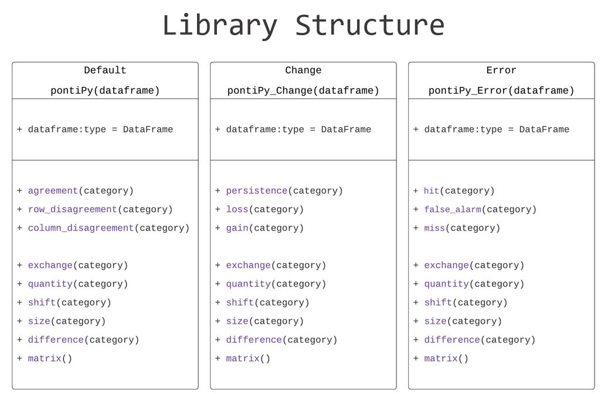
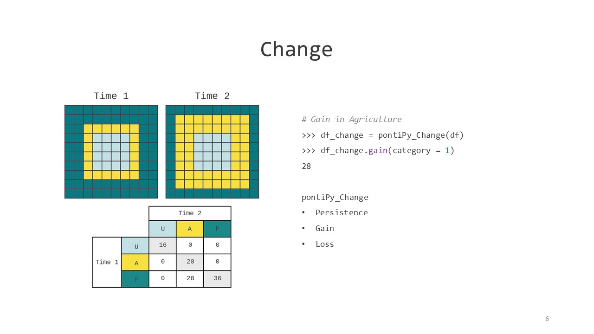
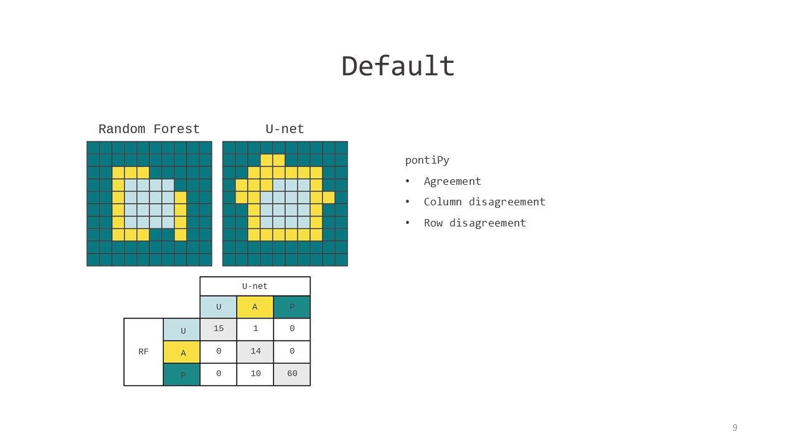

_A Python Library for Detecting Change in a Cross-Tab Matrix_

Cross-tabulation matrices are commonly used for accuracy assessment and map comparison. The metrics quantity, shift, and exchange can be used to measure differences in a cross-tabulation matrix. We developed an open-source python library that automates the calculations of these metrics. Researchers can now automate calculations of these metrics across large datasets as well as integrate with other statistical, analytical, visualization libraries.


#### Downloads & Dependencies  
- Installation
```
pip install pontiPy
```

- Dependency
```python
import pandas as pd
```




# Usage 

```python
from pontiPy import *
import pandas as pd

df = pd.read_csv('sample.csv', index_col = 0)
```


```python
# Net quantity change in Agriculture
>>> df_change.quantity(category=1)
8
>>> df_change.quantity(category=1, label =True)
{'Gain': 8}

# Exchange between Agriculture and Pasture
>>> pontiPy_Change.exchange(category=1, category=2)
2

# List all exchanges in Agriculture
>>> pontiPy_Change.exchange(category=1)
{0:0,2:2}
```





### Further Information & Contact
- **Library Information:**  
Priyanka Verma, priyanka.verma@mail.mcgill.ca    
Priscilla Ahn, ahnpriscilla@gmail.com  

- **Metric Methodolgy:**  
Robert (Gil) Pontius, rpontius@clarku.edu  
See Metrics that Make a Difference, Chapter 4  
Link to Chapter 4

### Acknowledgements

_Dr. Robert Gilmore Pontius Jr created the first version of this workbook in 2001. Pontius has revised this workbook several times, and each revision has a larger number for the suffix of the filename. Pontius created version 42 in 2019._  

_Visit www.clarku.edu/~rpontius for publications on this workbook's methods. Specificaly, see:
Pontius Jr, Robert Gilmore and Ali Santacruz. 2014. Quantity, Exchange and Shift Components of Differences in a Square Contingency Table. International Journal of Remote Sensing 35(21): 7543-7554._  

_Pontius Jr, Robert Gilmore. 2019. Component intensities to relate difference by category with difference overall. International Journal of Applied Earth Observations and Geoinformation 77: 94-99._  

_Pontius Jr, Robert Gilmore and Marco Millones. 2011. Death to Kappa: birth of quantity disagreement and allocation disagreement for accuracy assessment. International Journal of Remote Sensing 32(15): 4407-4429._  

_Aldwaik, Safaa Zakaria, Jeffrey A Onsted, and Robert Gilmore Pontius Jr. 2015. Behavior-based aggregation of land categories for temporal change analysis. International Journal of Applied Earth Observation and Geoinformation 35(Part B): 229-238._

### Contributors
Jason Jeng, Claire Wang, Samuel Wen, Jordan Frey, Maxwell Enger
